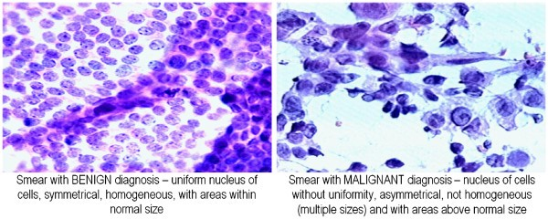

# Breast_Cancer_Wisconsin

## Introdução 
O avanço das ferramentas tecnológicas em consonância do avanço científico, trouxe melhorias significativas na área médica. Isso se deve sobretudo ao fato de que equipamentos mais sofisticados com maior poder instrumental dão a capacidade de investigar melhor o estado de saúde de uma paciente. Além disso, a utilização dessas ferramentas em novas pesquisas traz cada vez mais avanços em áreas que antes pareciam insolúveis. Uma outra perspectiva do assunto, é o enorme impacto que o aumento do poder computacional tem proporcionado nas áreas de saúde. Em específico, vamos destacar uma das mais delicadas e necessárias de investigação: O câncer.

O câncer foi caracterizado como uma doença heterogênea que consiste em muitos subtipos diferentes. O diagnóstico precoce
e o prognóstico de um tipo de câncer tornou-se uma necessidade na pesquisa do câncer, pois pode facilitar a subsequente avaliação clínica e o manejo de pacientes. A importância de classificar os pacientes com câncer em grupos de alto ou baixo risco tem levado muitas equipes de pesquisa, da área biomédica e bioinformática, a estudar a aplicação dos métodos de aprendizado de máquina (ML). 

Portanto, essas técnicas têm sido utilizadas com o objetivo de modelar a progressão e o tratamento de doenças cancerígenas. Além disso, a capacidade das ferramentas de ML de detectar os principais recursos de conjuntos de dados complexos revela sua importância. Uma variedade dessas técnicas, incluindo Redes Neurais Artificiais (RNAs), Redes Bayesianas (BNs),
Máquinas de vetores de suporte (SVMs) e árvores de decisão (DTs) têm sido amplamente aplicadas na pesquisa do câncer para o desenvolvimento de modelos preditivos, resultando em tomadas de decisão precisas e eficazes. Mesmo que seja evidente que
o uso de métodos de ML pode melhorar nossa compreensão da progressão do câncer, um nível apropriado de validação é
necessários para que esses métodos sejam considerados na prática clínica cotidiana. 

Neste trabalho, apresentamos uma revisão das abordagens recentes de ML empregadas na modelagem da progressão do câncer. Os modelos preditivos discutidos aqui são baseados em várias técnicas de ML supervisionadas. Dada a tendência crescente na aplicação de métodos de ML na pesquisa do câncer, **o objetivo deste trabalho é utilizar técnicas de ML para modelar e prever a classificação do diagnótico de pacientes: tumor benigno, ou tumor maligno (Câncer)**.

## Objetivos:
> **1) Entender o perfil e as características das células de tecidos com tumores benignos e malignos.**

> **2) O objetivo deste trabalho é utilizar técnicas de ML para modelar e prever a classificação do diagnótico de pacientes: tumor benigno, ou tumor maligno (Câncer).**

## Bibliotecas utilizadas:
- sklearn
- matplotlib
- numpy
- pandas 
- seaborn

## Integrantes:
- João Gabriel Valentim Rocha

## Professora:
- Maria Kelly Venezuela

## Referências:

-  [Yuefeng Zhang, PhD. Deep Learning in Wisconsin Breast Cancer Diagnosis](https://towardsdatascience.com/deep-learning-in-winonsin-breast-cancer-diagnosis-6bab13838abd)

-  [Breast Cancer Wisconsin (Diagnostic) Data Set](https://archive.ics.uci.edu/ml/datasets/Breast+Cancer+Wisconsin+%28Diagnostic%29)

- [Nuclear feature extraction for breast tumor diagnosis]()

- [Mãos à Obra: Aprendizado de Máquina com scikit-Learn, Keras e TensorFlow. Aurélien Géron](https://github.com/ageron/handson-ml2)

- [Scikit Learn biblioteca](https://scikit-learn.org/stable/index.html)

- W.H. Wolberg, W.N. Street, and O.L. Mangasarian. 
	Machine learning techniques to diagnose breast cancer from
	fine-needle aspirates.  
	Cancer Letters 77 (1994) 163-171.

- W.H. Wolberg, W.N. Street, and O.L. Mangasarian. 
	Image analysis and machine learning applied to breast cancer
	diagnosis and prognosis.  
	Analytical and Quantitative Cytology and Histology, Vol. 17
	No. 2, pages 77-87, April 1995. 

- W.H. Wolberg, W.N. Street, D.M. Heisey, and O.L. Mangasarian. 
	Computerized breast cancer diagnosis and prognosis from fine
	needle aspirates.  
	Archives of Surgery 1995;130:511-516.

- W.H. Wolberg, W.N. Street, D.M. Heisey, and O.L. Mangasarian. 
	Computer-derived nuclear features distinguish malignant from
	benign breast cytology.  
	Human Pathology, 26:792--796, 1995.

## Tecnologias usadas nesse projeto

